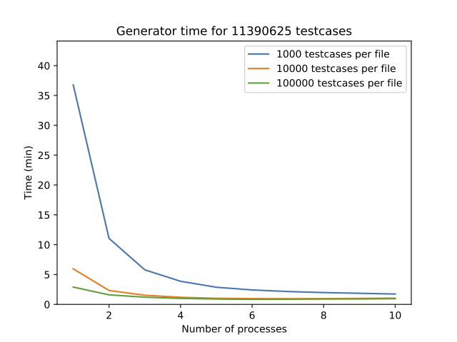

# Twins Generator
[](LICENSE.md)

This repository is dedicated to sharing material related to the Twins Generator. Software is provided for research-purpose only and is not meant to be used in production.

## Summary
The Twins generator has been carefullly designed to not require any external dependency, so it should work out of the box:
```
generator = Generator(4, 2, 8) # Create a generator instance with 4 nodes, 2 partitions, and 8 rounds.
generator.run() # Run the generator and print testcases to files.
```
The generator can take many other optional arguments such as the maximum number of testcases to print per file or the number of processes (for multiprocess execution). It also provides facilities to shard generation accross multiple machines. Detailed documentation can be found in the docstrings of the source file `generator.py`.

## Cli
The file `cli.py` provides a simple command line utility to run the generator, and requires `argparse` as dependency:
```
$ pip install argparse
$ python cli.py -h # Show help
$ python -O cli.py --nodes 4 --partitions 2 --rounds 4 --workers 16 -dryrun # Example usage
```
Be carefule when removing `-dryrun` as the generator may create a large number of files. Verbose logging can be activated with `-v`.

## Test
The generator should have 100% test coverage. You can install `pytest` with the following command:
```
$ pip install pytest
```
Then simply run:
```
$ pytest
```

## Benchmark
First install `matplotlib`:
```
$ pip install matplotlib
```
Then run one of the following commands:
```
$ python -O benchmark.py # Run a fast benchmark (should take a few minutes)
$ python -O benchmark.py full # Run a detailed benchmark and plot results
```
The following graph displays a benchmark run with 4 nodes, 2 partitions and 6 rounds. Experiments are run on an Apple laptop (MacBook Pro) with a 2.9 GHz Intel Core i9 (6 physical and 12 logical cores), and 32 GB 2400 MHz DDR4 RAM.



We can see that the generator takes less than 1 minute to generate about 11M testcases (ie. we can generate over 15 billion testcases a day).
The graph shows that the best results are obtained when running the generator with at least 5 processes (this makes sense as the laptop used for experiments has 6 physical cores); increasing the number of processes over 5 or the number of testcases per file over 10,000 do not improve performance.

## References
* [Twins: White-Glove Approach for BFT Testing](https://arxiv.org/abs/2004.10617)
* [Twins Simulator](https://github.com/asonnino/twins-simulator)

## License
The content of this repository is licensed as [Apache 2.0](https://github.com/asonnino/twins-generator/blob/master/LICENSE)

